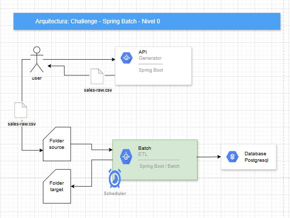
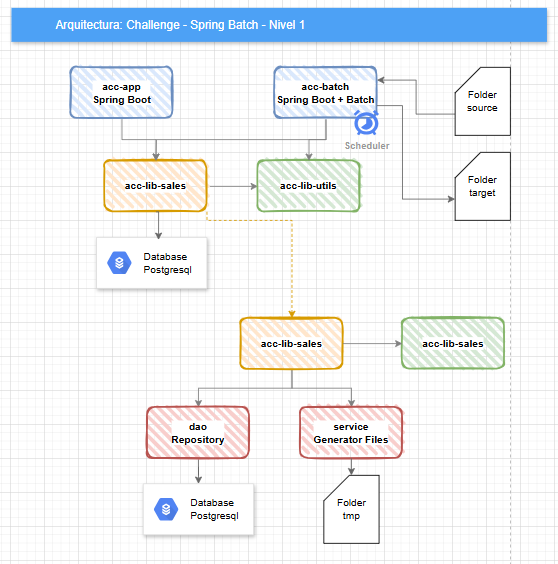
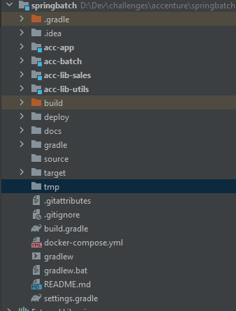

# Arquitectura - Challenge

---
## Requirementos
- Java 17
- Gradle
- Docker
- Postgresql

## Flujo
Tenemos el flujo siguiente:
1. Generar un archivo **sales-raw.csv** desde el microservicio "app" para simular los datos crudos 
```
URL: http://127.0.0.1:8080/batch/sales/csv/download?rows=[long] (por defecto 100000)
```
- Para ver la documentacion de la api: http://127.0.0.1:8080/batch/swagger-ui/index.html
- Para generar distintos tamaños de archivos csv, ejecutar estos ejemplos:
  - http://127.0.0.1:8080/batch/sales/csv/download?rows=50000 - 1,2 Kb - 1 seg aprox
  - http://127.0.0.1:8080/batch/sales/csv/download?rows=50000000 - 1,2 GB - 1 min aprox
  - http://127.0.0.1:8080/batch/sales/csv/download?rows=100000000 - 2,5 GB - 4 min aprox
  - http://127.0.0.1:8080/batch/sales/csv/download?rows=500000000 - 12,8 GB - 15 min aprox

2. Con el archivo ya generado, copiar el archivo con el nombre exacto: **sales-raw.csv** en la carpeta **source**

3. Ejecucion del proceso batch
   - Lectura CSV: Se lee el archivo **sales-raw.csv** línea por línea desde la carpeta **sources**
   - Transformación:
    - Omitir el campo “temperatura”.
    - Calcular impuestos.
   - Escritura en BD: Insertar los datos procesados en la tabla "sales" de la bd: batch
   - Mover el archivo ya procesado a la carpeta **target**

## Arquitectura

### 


### Diseño en modulos



- Propuse crear modulos y librerias con el objetivo de lograr una escalabilidad, mantenimiento y rendimiento
- Cada modulo tiene su responsabilidad
- Reutilizacion de codigo
- Mejor organizacion
- Dependencias mas claras

### Estructura del proyecto


## Observaciones
- Para generar un archivo grande CSV, tuve que crear procesamiento paralelo y dividir archivos.

## Propuestas de Mejoras
- [] Validaciones
  - [] Auditar los errores (guardar registros invalidos en una tabla de invalidaciones)
- [] Auditoria
  - [] Patrones de logs
  - [] Auditar los errores (guardar registros no procesados en una tabla de reintentos)  
- [] Performance
  - [] Mejorar en los threads
  - [] Mejorar el sistema de deteccion de archivos en la carpeta source
- [] Monitoreo
  - [] Auditar mejor los procesos para monitorear
  - [] Dashboard Power Bi con visualizaciones
  - [] Alertas (por email o slack)
- [] Bases de datos
  - [] Dividir en schemas 
    - batch (con tablas procesadas)
    - admin (con tablas de flyway y batches)
- [] Calidad
 - [] Test Unitarios y coberturas (JaCoCo, Mockito, Junit)

