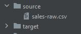
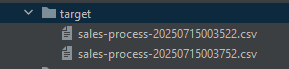

# Como compilar y levantar los servicios en el entorno local?

---


## Requirements
- Java 17
- Gradle
- Postgresql Local con user: postgres y pass: admin
- Git hash
```bash
# Create the new database
create database batch;
```
---

### 1.- Compilar usando el archivo 'gradle-build-all.sh'

1) Ir al directorio del proyecto:
```bash
C:\...\springbatch
```

2) Ir a la carpeta deploy:
```bash
cd deploy
```

3) Ejecutar este script shell, este script tambien se encarga de crear carpetas: source y target
```bash
./gradle-build-all.sh 

-----------------------------------------------------------------------
Prepare and Build
...
...
←[32;1mBUILD SUCCESSFUL←[0;39m in 39s
...
...
-----------------------------------------------------------------------
                    Local Batch Build Completed
-----------------------------------------------------------------------
```

### 2.- Levantar la aplicacion APP
1) Abrir una terminal Git hash
   
2) Ir al directorio del proyecto:
```bash
C:\...\springbatch
```

3) Ir a la carpeta deploy:
```bash
cd deploy
```

4) Ejecutar este script shell
```bash
./local-run-app.sh 
-----------------------------------------------------------------------
                            Run APP
-----------------------------------------------------------------------
...
...
2025-07-15T01:04:11.444-03:00  INFO 9220 --- [           main] w.s.c.ServletWebServerApplicationContext : Root WebApplicationContext: initialization completed in 3679 ms
2025-07-15T01:04:13.314-03:00  INFO 9220 --- [           main] o.s.b.w.embedded.tomcat.TomcatWebServer  : Tomcat started on port 8080 (http) with context path '/batch'
2025-07-15T01:04:13.345-03:00  INFO 9220 --- [           main] c.a.challenge.app.AppApplication         : Started AppApplication in 6.974 seconds (process running for 8.175)
```

- Para ver la documentacion de la api: http://127.0.0.1:8080/batch/swagger-ui/index.html
- Para generar csv's, ejecutar estos ejemplos:   
  - http://127.0.0.1:8080/batch/sales/csv/download?rows=50000 - 1,2 Kb - 1 seg aprox
  - http://127.0.0.1:8080/batch/sales/csv/download?rows=50000000 - 1,2 GB - 1 min aprox
  - http://127.0.0.1:8080/batch/sales/csv/download?rows=100000000 - 2,5 GB - 4 min aprox
  - http://127.0.0.1:8080/batch/sales/csv/download?rows=500000000 - 12,8 GB - 15 min aprox

### 3.- Levantar la aplicacion BATCH
1) Abrir otra terminal Git hash
   
2) Ir al directorio del proyecto:
```bash
C:\...\springbatch
```

3) Ir a la carpeta deploy:
```bash
cd deploy
```

3) Ejecutar este script shell
```bash
./local-run-batch.sh 
-----------------------------------------------------------------------
                            Run BATCH
-----------------------------------------------------------------------
...
...
2025-07-15T01:04:40.278-03:00  INFO 14928 --- [springbatch] [           main] o.s.o.j.p.SpringPersistenceUnitInfo      : No LoadTimeWeaver setup: ignoring JPA class transformer
2025-07-15T01:04:41.531-03:00  INFO 14928 --- [springbatch] [           main] o.h.e.t.j.p.i.JtaPlatformInitiator       : HHH000489: No JTA platform available (set 'hibernate.transaction.jta.platform' to enable JTA platform integrati
on)
2025-07-15T01:04:41.547-03:00  INFO 14928 --- [springbatch] [           main] j.LocalContainerEntityManagerFactoryBean : Initialized JPA EntityManagerFactory for persistence unit 'dataBatch'
2025-07-15T01:04:42.378-03:00  INFO 14928 --- [springbatch] [           main] c.a.challenge.app.BatchApplication       : Started BatchApplication in 8.251 seconds (process running for 9.194)
```

- Para probar las transacciones, sobre la carpeta **source** copiar cualquier archivo generado desde el microservicio de generador csv que lleve siempre el nombre: **sales-raw.csv**



- Entonces dentro de un minuto (configurable en SALES_FIXED_DELAY_JOB), el proceso batch se encargara de tomar este archivo para procesarlo y 
una vez procesado se movera este mismo archivo hacia otra carpeta de procesados como **target**



- Mientras el archivo original **sales-raw.csv** desaparece de la carpeta **source**


- Como resultado en la tabla **sales** de la base **batch**, veriamos N registros ya procesados y transformados. 

  