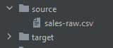
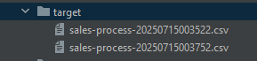
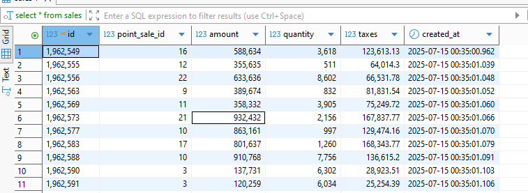

# Como deployar al Docker Local?

## Requirements
- Java 17
- Gradle
- Docker 
- Git hash
---

### 1.- Compilar usando el archivo 'gradle-build-all.sh'
1) Abrir una terminal Git hash

2) Ir al directorio del proyecto:
```bash
C:\...\springbatch
```

3) Ir a la carpeta deploy:
```bash
cd deploy
```

4) Ejecutar este script shell y este tambien crea carpetas source y target
```bash
./gradle-build-all.sh 

-----------------------------------------------------------------------
Prepare and Build
...
...
←[32;1mBUILD SUCCESSFUL←[0;39m in 39s
...
...
-----------------------------------------------------------------------
                    Local Batch Build Completed
-----------------------------------------------------------------------
```

### 2.- Buildear y levantar los servicios
1) Ir al directorio del proyecto:
```bash
C:\...\springbatch
```

2) Ir a la carpeta deploy:
```bash
cd deploy
```

3) Ejecutar este script shell
```bash
./docker-build-up-all.sh
Construir las imágenes
time="2025-07-15T01:13:29-03:00" level=warning msg="D:\\Dev\\challenges\\accenture\\springbatch\\docker-compose.yml: the attribute `version` is obsolete, it will be ignored, please remove it to avoid potential confusion"
Compose can now delegate builds to bake for better performance.
 To do so, set COMPOSE_BAKE=true.
[+] Building 12.4s (16/16) FINISHED                                                                                                                                                                                docker:desktop-linux
 => [app internal] load build definition from Dockerfile                                                                                                                                                                           0.2s
 => => transferring dockerfile: 152B                                                                                                                                                                                               0.2s
 => [batch internal] load build definition from Dockerfile 
...
...
[+] Building 2/2
 ✔ app    Built                                                                                                                                                                                                                    0.0s
 ✔ batch  Built 
Levantar los servicios
time="2025-07-15T01:13:42-03:00" level=warning msg="D:\\Dev\\challenges\\accenture\\springbatch\\docker-compose.yml: the attribute `version` is obsolete, it will be ignored, please remove it to avoid potential confusion"
[+] Running 4/4
 ✔ Network springbatch_default  Created                                                                                                                                                                                            0.1s
 ✔ Container app                Started                                                                                                                                                                                            1.1s
 ✔ Container postgres-db        Started                                                                                                                                                                                            1.2s
 ✔ Container batch              Started  
```

## API Generator CSV

- Para ver la documentacion de la api: http://127.0.0.1:8080/batch/swagger-ui/index.html
- Para generar csv's, ejecutar estos ejemplos:
   - http://127.0.0.1:8080/batch/sales/csv/download?rows=50000 - 1,2 Kb - 1 seg aprox
   - http://127.0.0.1:8080/batch/sales/csv/download?rows=50000000 - 1,2 GB - 1 min aprox
   - http://127.0.0.1:8080/batch/sales/csv/download?rows=100000000 - 2,5 GB - 4 min aprox
   - http://127.0.0.1:8080/batch/sales/csv/download?rows=500000000 - 12,8 GB - 15 min aprox

## Batch

- Para probar las transacciones, sobre la carpeta **source** copiar cualquier archivo generado desde el microservicio de generador csv que lleve siempre el nombre: **sales-raw.csv**
  


- Entonces dentro de un minuto (configurable en SALES_FIXED_DELAY_JOB), el proceso batch se encargara de tomar este archivo para procesarlo y
  una vez procesado se movera este mismo archivo hacia otra carpeta de procesados como **target**
  


- Mientras el archivo original **sales-raw.csv** desaparece de la carpeta **source**
  


- Como resultado en la tabla **sales** de la base **batch**, veriamos N registros ya procesados y transformados.
  
  